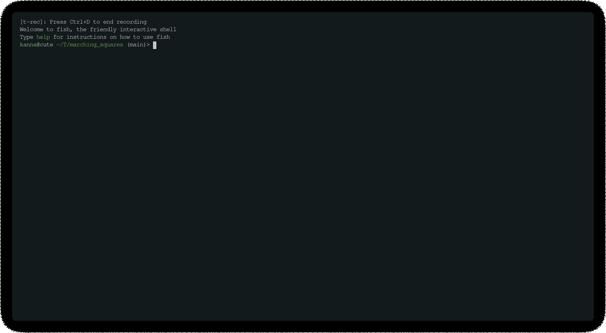

# Marchin squares
Trying out this algorithm to render text-based terminal graphic using rust.

This is basically a terminal-based metaballs similator.

## Tested requirements
* Cargo (>=1.53.0)

## Build
* `cargo build --release`

I tried to change the committing email address using git. I have no idea why the nothankyou1 user is in the contributor. I probably messed up somewhere.
